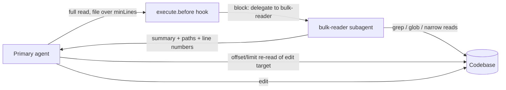
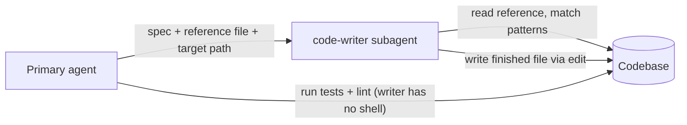

<h1 style="font-family: Baskerville, serif; font-size: 3em;">Big-Little</h1>

[](https://www.npmjs.com/package/big-little)
[](LICENSE)
[](https://nodejs.org)
[](https://opencode.ai)

OpenCode plugin. Big model keeps orchestration. Little worker subagents do bulk reads and boilerplate.

<p align="center">
  
</p>

## Contents

- [Contents](#contents)
- [Install](#install)
- [Verify your install](#verify-your-install)
- [Configuration](#configuration)
- [Examples](#examples)
- [How it works](#how-it-works)
  - [bulk-reader flow](#bulk-reader-flow)
  - [code-writer flow](#code-writer-flow)
- [What it does](#what-it-does)
- [Limits](#limits)

Requires OpenCode 2.x (tested on 2.0.16).

## Install

```json
{
  "$schema": "https://opencode.ai/config.json",
  "plugins": ["big-little"]
}
```

Restart OpenCode after install. Restart picks up config changes.

Local plugin directories need a top-level `index.js`/`index.ts` entrypoint for
OpenCode discovery; this package ships one that re-exports `dist/index.js`, so
both `"plugins": ["/absolute/path/big-little"]` and the npm package work.

## Verify your install

Project plugins load when their location boots (for example on session start),
not for `debug` commands. With a session open in a project that enables this
plugin, run:

```bash
opencode api agent.list --param 'location[directory]=/path/to/project'
```

Check that `bulk-reader` and `code-writer` appear with `mode: "subagent"` and a
`permissions` array (no `temperature`, no `prompt`, no `bash`/`task` actions).
This uses no model. (`opencode debug config` only lists config sources, and
`debug agents` does not reflect plugin-registered agents.)

## Configuration

Every option is optional. Env vars apply only when the matching option is absent.

With options (object form):

```json
{
  "plugins": [
    { "package": "big-little", "options": { "minLines": 500 } }
  ]
}
```

| Option | Env fallback | Default | Rule |
| --- | --- | --- | --- |
| `minLines` | `BIGLITTLE_MIN_LINES`, then deprecated `SHUNT_MIN_LINES` | `350` | Positive integer. Zero, negative, or garbage means `350`. |
| `bulkReaderModel` | `BIGLITTLE_BULK_READER_MODEL` | unset (inherit caller model) | Example `opencode/nemotron-3.5-lightning-free`. |
| `codeWriterModel` | `BIGLITTLE_CODE_WRITER_MODEL` | unset (inherit caller model) | Same semantics. |

Model picks below are [OpenCode Zen](https://opencode.ai/docs/zen/#pricing) free-tier models (`opencode/nemotron-3.5-lightning-free` reads, `opencode/mimo-v2.5-free` writes), so most users already have them. Free-tier availability is limited-time — run `/models` in the TUI to confirm before pinning.

## Examples

1. Defaults only (350-line threshold, workers inherit your model):

```json
{
  "plugins": ["big-little"]
}
```

1. Custom threshold only:

```json
{
  "plugins": [{ "package": "big-little", "options": { "minLines": 500 } }]
}
```

1. Cheap bulk-reader only (the main cost saver; threshold stays 350):

```json
{
  "plugins": [{ "package": "big-little", "options": { "bulkReaderModel": "opencode/nemotron-3.5-lightning-free" } }]
}
```

1. Code-writer model only:

```json
{
  "plugins": [{ "package": "big-little", "options": { "codeWriterModel": "opencode/mimo-v2.5-free" } }]
}
```

1. Both workers pinned, default threshold:

```json
{
  "plugins": [
    {
      "package": "big-little",
      "options": {
        "bulkReaderModel": "opencode/nemotron-3.5-lightning-free",
        "codeWriterModel": "opencode/mimo-v2.5-free"
      }
    }
  ]
}
```

1. Everything set:

```json
{
  "plugins": [
    {
      "package": "big-little",
      "options": {
        "minLines": 500,
        "bulkReaderModel": "opencode/nemotron-3.5-lightning-free",
        "codeWriterModel": "opencode/mimo-v2.5-free"
      }
    }
  ]
}
```

Any option left out falls back to its env var, then the default (see table above). Env-only setup with zero options:

```bash
export BIGLITTLE_MIN_LINES=500
export BIGLITTLE_BULK_READER_MODEL=opencode/nemotron-3.5-lightning-free
export BIGLITTLE_CODE_WRITER_MODEL=opencode/mimo-v2.5-free
```

## How it works

### bulk-reader flow



Targeted reads (`offset`/`limit` set) and piped shell commands skip the hook entirely.

### code-writer flow



## What it does

- Registers `bulk-reader` (read-only explorer) and `code-writer` (boilerplate writer via `edit`) through `ctx.agent.transform` (upsert via `editor.update`).
- Blocks full-file `read` over threshold via `ctx.tool.hook("execute.before")`. Message names `bulk-reader` and offers `offset/limit` retry. The guard reads the V2 `path` key and resolves relative paths against the calling session's directory (cached lookup, fail open).
- Blocks `cat|head|tail|less|more` over threshold on the `shell` tool. Piped commands pass.
- Targeted reads (`offset` or `limit` set) always pass.

## Limits

- Set a cheap worker model or you get discipline without cost saving.
- Re-read target sections with `offset/limit` before edit. Worker line numbers can drift.
- Keep debugging and architecture on the main model.
- `code-writer` cannot run shell or network. Caller runs tests and lint.
- Relative paths are resolved against the calling session's directory; if that lookup fails the guard fails open to raw-path behavior.

## Benchmark selection
- https://hub.harborframework.com/tasks/terminal-bench/data-anonymization
- https://hub.harborframework.com/tasks/terminal-bench/multi-source-data-merger
- https://hub.harborframework.com/tasks/swe-bench/scikit-learn__scikit-learn-14053
- https://hub.harborframework.com/tasks/swe-bench/scikit-learn__scikit-learn-14710
